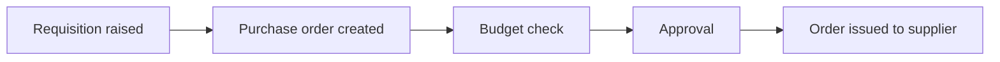
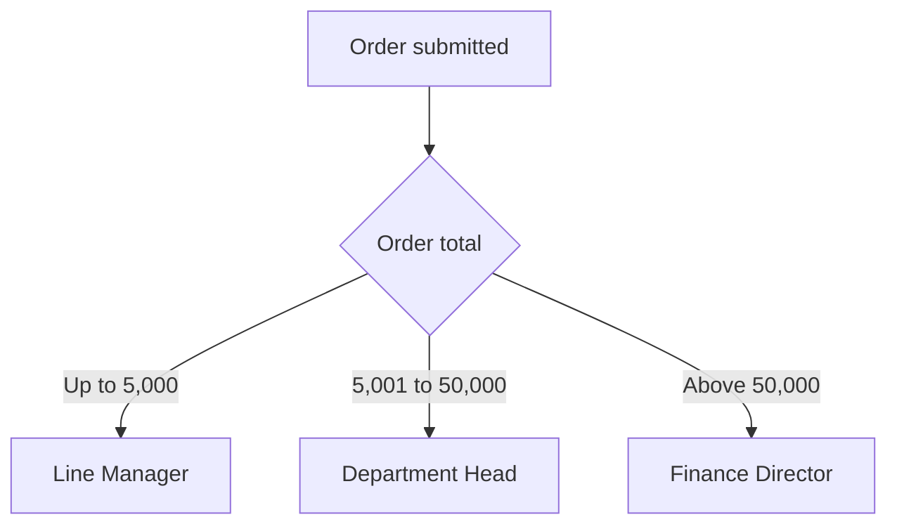
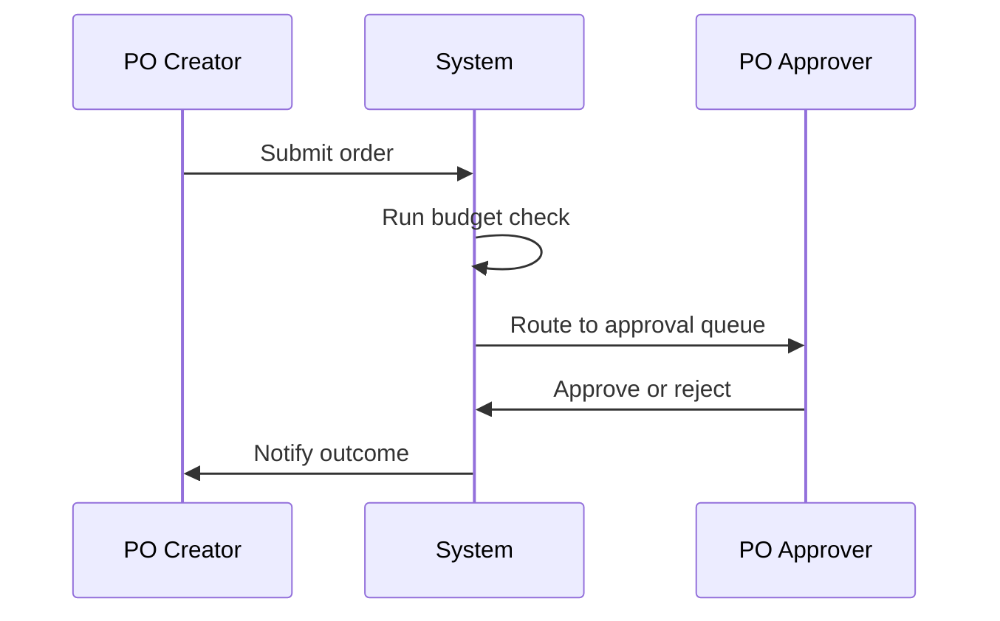
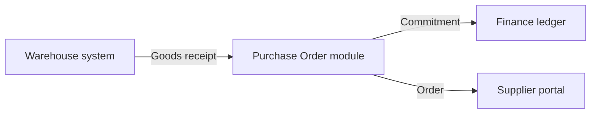
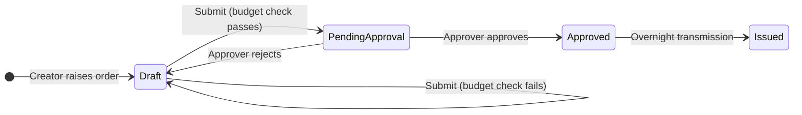

# Diagrams

The plan stores diagrams as **Mermaid source**, not as pictures. That is what makes them
reviewable in a diff, regenerable when the process changes, and checkable against the text
they came from.

## The rule that matters most

**A diagram is an interpretation of the document, so it cites the document like any other
block.** A process flow drawn from three paragraphs of prose carries those three anchors. If
you cannot cite the text a box or an arrow came from, that box or arrow is something we
decided, not something the specification says — and a diagram is exactly where an invented
step hides best, because it looks authoritative.

Two further rules:

- **Draw only what the text states.** If the spec never says what happens when an approver
  does nothing, the diagram has no timeout arrow. The absence is a `[GAP]`, not a gap to fill
  with a reasonable guess.
- **Use the system's own state and step names**, verbatim. A diagram that renames "Pending
  Approval" to "Awaiting sign-off" teaches a status that does not exist.

## The five patterns

Keeping the set narrow is deliberate: a training deck wants a few legible shapes, not every
chart Mermaid can draw. `render_diagram.py` enforces the pairing between pattern and Mermaid
diagram type.

### `process-flow` — the end-to-end task
For "here is the whole process before we look at any screen". `graph LR` for a short linear
flow, `graph TD` when it branches.



### `decision-tree` — routing and conditions
For approval routing, eligibility, or any "it depends" the learner has to reason through.
Label every branch with its condition.



### `swimlane` — who does what, in sequence
For a process crossing roles. `sequenceDiagram` reads better than a lane graph at slide size
and makes the handoffs explicit.



### `landscape` — systems and interfaces
For "what talks to what", in the downstream-impact module. Keep it to the systems the
learner's actions actually reach.



### `state-transition` — statuses and what moves between them
The highest-value diagram in most system training, because status confusion is the most
common support call. Label every arrow with the event, not just the outcome.



## Keeping them legible

- **A slide is 16:9, so lay diagrams out left-to-right.** `graph LR`, or `direction LR`
  inside a `stateDiagram-v2`. The same diagram top-to-bottom becomes a tall column with a
  third of the slide's width used, and long edge labels start colliding — which is the most
  common reason a generated diagram looks broken. Compare before settling:
  ```bash
  python scripts/render_diagram.py <plan> -o /tmp/diagrams   # then look at the PNGs
  ```
- **Under about 12 nodes.** `render_diagram.py` rejects a source over 40 lines outright, but
  the practical limit at slide size is lower. Two clear diagrams beat one complete one.
- **Label arrows with events, not outcomes.** "Submit (budget check fails)" tells the learner
  what they did to cause it; "Failed" does not.
- **Self-loops earn their place.** `Draft --> Draft: Submit (budget check fails)` is the
  single most useful arrow in the PO example, because "it comes back to you" is what people
  get wrong.
- **Check it rendered.** Validate before building:
  ```bash
  python scripts/render_diagram.py <plan> --check
  ```
  and in the HTML deck, look at the slide. A diagram that failed to render shows its source in
  an amber panel labelled "DIAGRAM DID NOT RENDER" — visible by design, so it cannot ship as
  a blank space.

## Redrawing a picture the document already has

Legitimate, and common: specification diagrams are often screenshots of a modelling tool,
unreadable at slide size and impossible to update. Redraw it, cite the same anchor, and put
the original in `excluded_assets` with the reason. What is not legitimate is redrawing it
*differently* — if your version has a step the original does not, either the original is
wrong or you invented one, and both need saying out loud rather than resolving silently in
a diagram.
